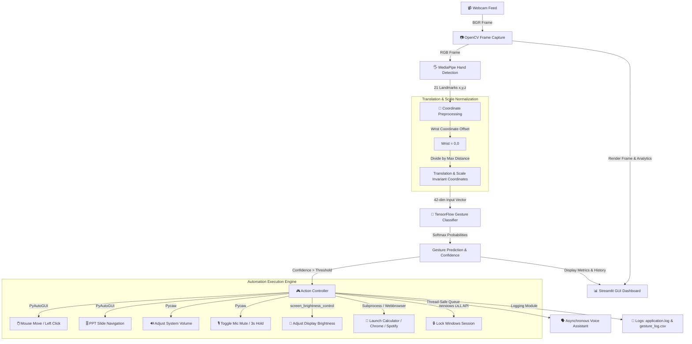
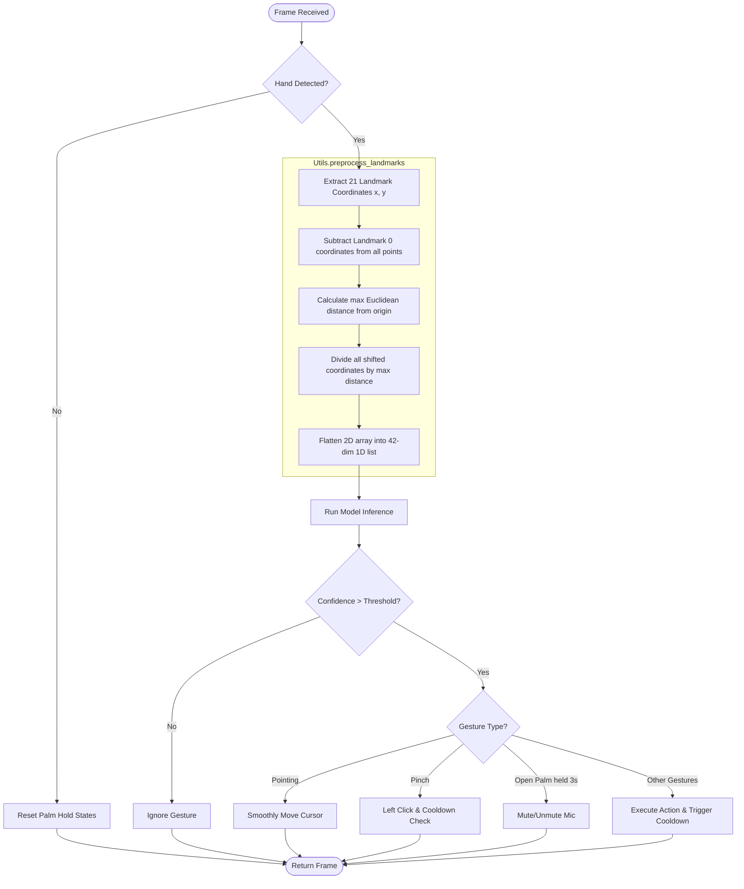
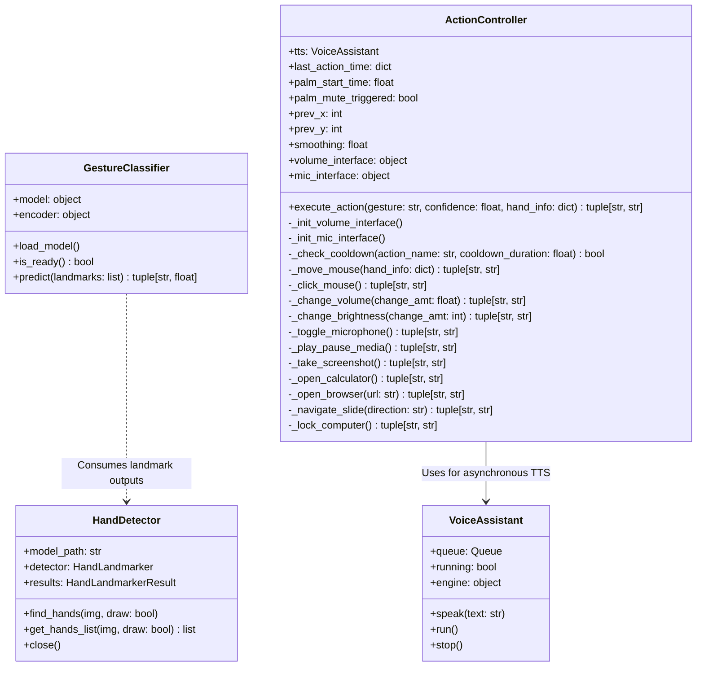

# AI-Powered Hand Gesture Recognition and Computer Control System

A production-ready, real-time hand tracking and gesture recognition system that maps 15 distinct hand postures to system-level automations on Windows 10/11 (volume/brightness control, mouse navigation, media control, application launching, desktop locking, and screen capturing). 

The system uses **MediaPipe Hands** for landmark tracking, a **TensorFlow/Keras Deep Neural Network** for gesture classification, a **threaded Voice Assistant** for audio confirmations, and a interactive **Streamlit Dashboard** displaying live analytics, meters, and event logs.

---

## 🛠️ Technology Stack

* **Programming Language**: Python 3.11 / 3.13
* **Computer Vision**: OpenCV, MediaPipe Hands
* **Machine Learning**: TensorFlow / Keras, NumPy, Pandas, Scikit-learn, Joblib
* **System Automation**: PyAutoGUI, Pycaw, Screen-Brightness-Control
* **User Interface**: Streamlit
* **Acoustics & Assistive Tech**: pyttsx3 (Text-to-Speech)
* **Software Design**: OOP (Object-Oriented Programming), Threading, Structured Logging, Robust Exception Handling

---

## 🏗️ System Architecture



---

## 📦 Installation Guide

### Prerequisites
* Windows 10/11 Operating System
* Python 3.8 to 3.13 installed
* Webcam connected and verified

### Steps
1. **Clone or Extract the Project**:
   ```bash
   cd "c:\Users\DELL\OneDrive\Desktop\Hand Gesture"
   ```

2. **Install Dependencies**:
   Install all required libraries listed in `requirements.txt`:
   ```bash
   pip install -r requirements.txt
   ```

---

## 🚀 Execution Guide

The system contains separate modules for data collection, model training, standalone command-line checking, and the Streamlit UI dashboard.

### Step 1: Collect Custom Landmark Dataset (Optional)
If you want to train the model on your own hand gestures, run the interactive collector:
```bash
python -m src.collect_data
```
* **Controls**:
  * Select the gesture index in the console prompt.
  * In the video window, press **S** (or hold down) to save landmark samples. Collect **300 samples** per gesture.
  * Press **C** to toggle autosave mode.
  * Press **N** to select another gesture.
  * Press **Q** to close the window.

*Note: If you do not have custom data, you can skip to Step 2; the training script automatically generates a clean mock dataset of representative hand postures if the CSV is missing.*

### Step 2: Train TensorFlow Model
Process the dataset, train the Deep Neural Network, and plot evaluation metrics:
```bash
python -m src.train_model
```
This script:
1. Normalizes the coordinates to translation- and scale-invariant layouts.
2. Trains the neural network architecture (`Dense(256) -> Dropout(0.3) -> Dense(128) -> Dropout(0.3) -> Dense(64) -> Softmax(15)`).
3. Saves the model to `models/gesture_model.h5` and encoder to `models/label_encoder.pkl`.
4. Generates performance curves and a confusion matrix inside `assets/`.

### Step 3: Run the Streamlit Dashboard (Primary Interface)
Launch the primary GUI dashboard:
```bash
python app.py
```
This runs a local Streamlit server. Once open in your browser:
1. Click **Start Recognition Engine** in the sidebar.
2. Toggle the camera feed, adjust the confidence thresholds, and view live volume meters, gesture counts, and logs.

### Step 4: Standalone Inference Debugging (Alternative Interface)
If you want to run the model outside the web browser inside a high-speed raw OpenCV window:
```bash
python -m src.predict
```
* Press **Q** in the camera window to exit.

---

## 📐 Data Processing Flowchart



---

## 👁️ Class Diagram



---

## 🎛️ Mapping Action Matrix

| Gesture | Icon | Primary System Action | Spoken Verbal Confirmation | Cooldown Type |
|---|---|---|---|---|
| **Thumbs Up** | 👍 | Increase volume by 5% | "Volume Increased" (rate-limited) | Continuous (0.2s) |
| **Thumbs Down** | 👎 | Decrease volume by 5% | "Volume Decreased" (rate-limited) | Continuous (0.2s) |
| **Open Palm** | ✋ | Play/Pause media player | None (Immediate) | Discrete (2.0s) |
| **Fist** | ✊ | Lock Windows computer session | "System Locking" | Custom (5.0s) |
| **Peace** | ✌️ | Take screenshot (saved to `screenshots/`) | "Screenshot Taken" | Discrete (2.0s) |
| **OK Sign** | 👌 | Open Windows Calculator application | "Calculator Opened" | Discrete (2.0s) |
| **Pointing** | ☝️ | Move mouse cursor across the screen | None (Real-time tracking) | None (Instant) |
| **Pinch** | 🤏 | Perform left mouse click | None (Immediate) | Click-specific (0.8s)|
| **Swipe Right** | 👉 | Navigate to next slide (Page Down) | "Presentation Started" (on first swipe) | Discrete (2.0s) |
| **Swipe Left** | 👈 | Navigate to previous slide (Page Up) | "Presentation Started" | Discrete (2.0s) |
| **Five Fingers** | 🖐️ | Open Chrome browser | "Browser Opened" | Discrete (2.0s) |
| **Call Gesture** | 🤙 | Open WhatsApp Web | "Browser Opened" | Discrete (2.0s) |
| **Heart Gesture**| ❤️ | Open Spotify Web player | "Browser Opened" | Discrete (2.0s) |
| **Palm Held 3s** | ✋⏱️ | Mute/Unmute system microphone | "Microphone Muted" / "Unmuted" | State-bound |
| **Brightness Gest**| ✌️ (parallel) | Increase display brightness by 10% | "Brightness Increased" | Continuous (0.2s) |
| **Two Finger Down**| ⬇️ (parallel) | Decrease display brightness by 10% | "Brightness Decreased" | Continuous (0.2s) |

---

## 🚀 Future Enhancements
1. **Dynamic Gesture Support**: Integrate LSTM or GRU networks on sequences of frames to recognize dynamic complex gestures (like circling to adjust volume, waving to dismiss notifications) instead of static postures.
2. **Two-Hand Coordination**: Add two-handed gesture combinations (e.g., left hand select canvas mode, right hand draw/manipulate 3D objects).
3. **Low-Light Optimization**: Integrate automatic contrast enhancement (like CLAHE) on frames before passing them to MediaPipe in dim environments.

---

## 💬 Interview Questions & Answers

### Q1: Why did you preprocess the landmark coordinates instead of passing raw MediaPipe outputs directly to the neural network?
**Answer**: MediaPipe returns landmarks relative to the camera frame. If we pass these raw coordinates, the neural network would learn the specific *location* in the video stream where the gesture occurred. If a user made a "Fist" on the left side of the frame, the model might not recognize it on the right side.
To achieve **translation invariance**, we subtract the wrist coordinate (landmark 0) from all other 20 landmarks, shifting the gesture's origin to $(0,0)$.
To achieve **scale invariance**, we find the maximum Euclidean distance from the wrist among all landmarks and divide all coordinates by this maximum distance. This guarantees that whether the user is close to the camera or far away, the input vector values remain identical, dramatically improving model generalization.

### Q2: Why did you write a custom background thread for the Text-to-Speech (TTS) Voice Assistant instead of calling `pyttsx3` directly in the detection loop?
**Answer**: The `pyttsx3` speech engine is synchronous; calling `engine.say()` and `engine.runAndWait()` blocks the executing thread until the spoken phrase completes. In real-time computer vision loops, blocking the main thread for 1-2 seconds drops the frame rate to 0 FPS, creating severe lagging.
By designing `VoiceAssistant` as a separate, daemonized background thread communicating via a thread-safe `Queue`, we can drop speech requests into the queue instantaneously. The background worker fetches the items and runs them sequentially. Because pyttsx3 is initialized and run *entirely* inside that background thread, Windows COM threading errors are also bypassed.

### Q3: How did you implement mouse movement tracking, and how did you resolve coordinate jitter?
**Answer**: Mouse movement uses the index finger tip (landmark 8) normalized coordinate.
1. **Clamping and Mapping**: We map a central "active bounding box" of the webcam coordinate space (e.g., $X$ and $Y$ coordinates between $0.25$ and $0.75$) to the user's full resolution screen dimension. This lets the hand cover the entire monitor without stretching to the physical edges of the camera.
2. **Jitter Smoothing**: Hands naturally tremble, and webcam inputs contain pixel-level noise, which leads to cursor shaking. To resolve this, we implemented **Exponential Moving Average (EMA)** smoothing:
   $$X_{\text{smoothed}} = \alpha \cdot X_{\text{new}} + (1 - \alpha) \cdot X_{\text{previous}}$$
   We selected $\alpha = 0.25$, which yields a very smooth, fluid cursor tracking experience without noticeable latency.
